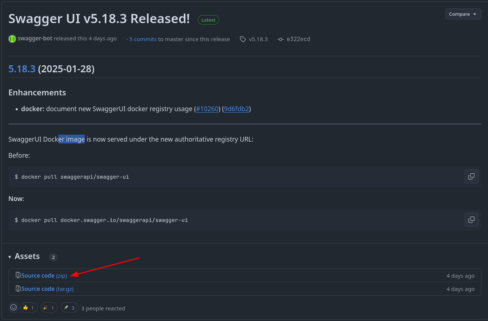

Today we will look at how you can serve, validate, and build api documentation using openapi, swagger and redoc. Although this tutorial for building bundles of openapi is language agnostic we are using go for serving the html files. Generally you can use any language for serving static file content 😄. Let's begin

!!! warning
    You will need nodejs, pnpm installed on system.

# Preparing and building openapi
- Create folder apidocs/docs using `mkdir -p apidocs/docs`
- Copy content from https://raw.githubusercontent.com/swagger-api/swagger-petstore/refs/heads/master/src/main/resources/openapi.yaml in `docs/oapi.yaml`
- Install redocly to build and lint `pnpm install @redocly/cli@latest`.
- Lint the file using command `node_modules/.bin/redocly lint docs/oapi.yaml`.
- Build the single api file using command `node_modules/.bin/redocly bundle docs/oapi/oapi.yaml -o docs/openapi.yaml`.

# Creating swagger script
- Download the source code zip file from [swagger-ui project](https://github.com/swagger-api/swagger-ui/releases/)

- Unzip it and copy dist folder in `apidocs/docs` folder.
- Copy the built `apidocs/openapi.yaml` into `apidocs/docs/dist` folder.
- Rename some of attribute in dist folder js file to point to copied openapi.yaml file.
